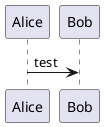

# 什么是 React



```ad-info
title: 参考文档
[React 官方文档](https://zh-hans.reactjs.org/docs/getting-started.html)
```

<iframe src="https://zh-hans.reactjs.org/docs/getting-started.html" allow="fullscreen" allowfullscreen="" style="height: 100%; width: 100%; aspect-ratio: 4 / 3;"></iframe>

[[组件创建 & 挂载]]
[[JSX 基础]]
[[State & Props]]
[[组件生命周期]]
[[组件通信]]
[[受控组件 & 非受控组件]]

# React 应用设计

```ad-info
title: 参考文档
[React 哲学 – React](https://zh-hans.reactjs.org/docs/thinking-in-react.html)
```

[[React Router]]

# Redux & Mobx

```ad-info
title: 参考文档

```

[高阶组件入门](app://obsidian.md/%E9%AB%98%E9%98%B6%E7%BB%84%E4%BB%B6%E5%85%A5%E9%97%A8)
[React Hook 入门](app://obsidian.md/React%20Hook%20%E5%85%A5%E9%97%A8)
